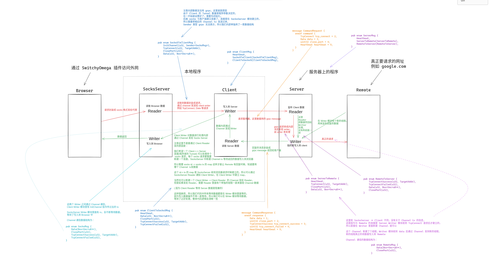

# Proxy Tools

Browser SiwthyOmega -> [Local SocksServer -> LocalClient] -> Server -> Remote


## Dependencies
```
sudo apt install protobuf-compiler
```

## Build
```
cargo build --release
```

## Test
```
sudo apt install netcat
```

### Tcp test
为了方便，我们展示怎么在本地测试
```
./server  # 在本地启动 server
./client --server-url 127.0.0.1：9527 --tunnel-cnt 1 no-auth # 新建窗口启动 client
nc -l 1234 # 以 TCP 模式监听端口 1237
nc -X 5 -x 127.0.0.1:9020 127.0.0.1 1234 # 用 socsk5 协议，走本地 9020 端口请求 1234 端口数据
```
然后在两个 `nc` 窗口发送消息如果代理正常就能在另外一个窗口看到，可以先不走代理确认下命令可用
```
nc -l 1234
nc 127.0.0.1 1234
```

### Udp test


## Structure



sudo apt install dante-client

nc -lu 192.168.31.96 1234
nc -u 192.168.91.96 1234


SOCKS_SERVER=127.0.0.1:9020 socksify nc -u 192.168.91.96 1234
